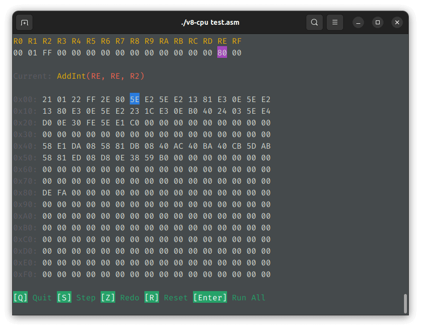

# v8-cpu



An interactive terminal UI to simulate v8-cpu programs, implemented in Rust.

## Installation

You can either download the binary from [Release page](https://github.com/Mivik/v8-cpu/releases), or [build from source](#build-from-source).

## Build from source

```shell
git clone https://github.com/Mivik/v8-cpu.git && cd v8-cpu
cargo install --path .
```

## Usage

```shell
# Launch an interactive terminal UI to simulate the program
./v8-cpu program.asm

# Also supports hex file (see the example below)
./v8-cpu -f hex program.hex

# And raw binary can be input too
./v8-cpu -f binary program.bin

# In quiet mode, the simulator will only give the final result
./v8-cpu -q program.asm
```

### Hex file example

This is an example from http://v8cpu.qinyue.world/

```plain
; Exercise-2.3 Calculate 1 + 2 + ... + 10
;
; Requirement:
;   * calculate 1 + 2 + ... + 10 and store the result in RC
;
; The following program does not meet the above requirements. Try correcting it.

2010
2101
2C00
2201
B210
5CC2
5221
B006
C000
```

## License

Licensed under MIT license, see [LICENSE](LICENSE) or http://opensource.org/licenses/MIT for details.
